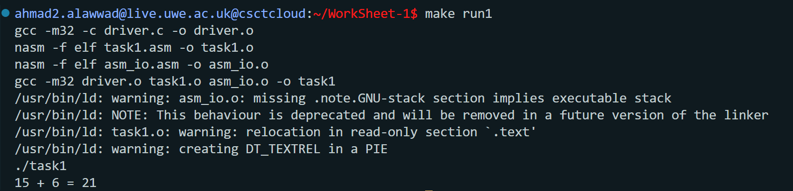
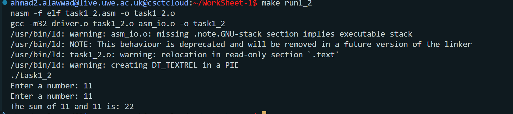

# Worksheet 1 – An Echo of Assembler
**Module:** UFCFWK-15-2 Operating Systems  
**Author:** Ahmad Alawwad  
**Tutor:** Benedict R. Gaster  

---

## Overview
This worksheet introduces low-level programming in x86 Assembly (NASM) and shows how assembler connects to C.  
It includes:
- Writing basic assembler functions  
- Calling assembly from C  
- Using loops, arrays, and conditionals  
- Automating builds with `make`

---

## Task 1 – Basic Assembly

### Goal  
Write an assembly program that adds two integers and prints the result.

### Files  
- `task1.asm` – adds 15 + 6 and prints `15 + 6 = 21`  
- `task1_2.asm` – asks the user for two numbers, adds them, and prints the result  
- `driver.c` – calls `asm_main()`  
- `asm_io.asm`, `asm_io.inc` – input/output macros provided by the lecturer  

### Build and Run  
```bash
make run1      # builds and runs task1
make run1_2    # builds and runs task1_2
```
### Screenshots
#### Task 1

#### Task 1_2

