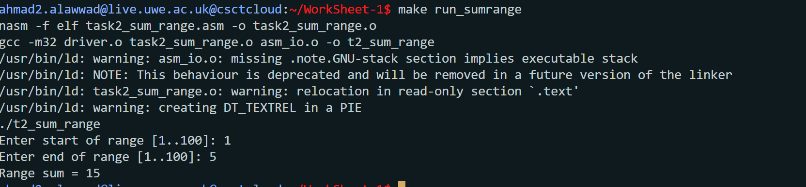

# Worksheet 1 – An Echo of Assembler
**Module:** UFCFWK-15-2 Operating Systems  
**Author:** Ahmad Alawwad  
**Tutor:** Benedict R. Gaster  

---

## Overview
This worksheet introduces low-level programming in x86 Assembly (NASM) and shows how assembler connects to C.  
It includes:
- Writing basic assembler functions  
- Calling assembly from C  
- Using loops, arrays, and conditionals  
- Automating builds with `make`

---

## Task 1 – Basic Assembly

### Goal  
Write an assembly program that adds two integers and prints the result.

### Files  
- `task1.asm` – adds 15 + 6 and prints `15 + 6 = 21`  
- `task1_2.asm` – asks the user for two numbers, adds them, and prints the result  
- `driver.c` – calls `asm_main()`  
- `asm_io.asm`, `asm_io.inc` – input/output macros provided by the lecturer  

### Build and Run  
```bash
make run1      # builds and runs task1
make run1_2    # builds and runs task1_2
```
---
### Screenshots
#### Task 1

#### Task 1_2

---


## Task 2 – Loops and Conditionals

### Goal
The goal of this task is to learn how loops and if-statements work in assembly.  
You will write small programs that use jumps and comparisons to repeat actions or check conditions.

### Files
- `task2_repeat_name.asm` – asks for your name and prints a welcome message many times.  
- `task2_sum100.asm` – adds all numbers from 1 to 100.  
- `task2_sum_range.asm` – adds numbers in a range chosen by the user.

### Build and Run
Use these commands to build and run each program:
```bash
make run_repeat      # run the repeat name program
make run_sum100      # run the sum 1..100 program
make run_sumrange    # run the range sum program
```
---
### Screenshots
#### Task 2_repeat

#### Task 2_sum10

#### Task 2_sumrange

---

## Task 3 – Makefile

### Goal
The goal of this task is to make it easier to build and run all the programs using one simple tool called **make**.  
Instead of typing long commands every time, the Makefile handles everything for you.

### Files
- `Makefile` – a file that tells the computer how to build and run all your assembly programs.  
- Uses the same `.asm` and `.c` files from Tasks 1 and 2.

### Build and Run
You can use these commands to build and run your programs:
```bash
make          # builds all programs
make clean    # deletes object files and executables
make run1     # runs Task 1
make run1_2   # runs Task 1.2
make run_repeat
make run_sum100
make run_sumrange
